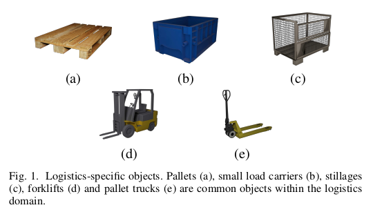

# LOCO: Logistics Objects in Context
[//]: # ""

LOCO is an image dataset focusing on object detection in logistics scenes. Images are captured while walking through a logistics setting using low-cost consumer cameras. We currently provide 37,988 images captured in 5 logistics environments, of which 5593 images are manually annotated, resulting in 152,421 annotations. Annotated classes include pallets, small load carriers, pallet trucks, forklifts and stillages.  

For more details, we refer the reader to the official [paper](https://mediatum.ub.tum.de/doc/1578845/1578845.pdf). If you use LOCO for your work, please consider [citeing](https://mediatum.ub.tum.de/export/1578845/bibtex).

## Dataset
### Data
The zipped dataset can be downloaded [here](TODO). It contains two subfolders, representing annotated and not annotated data.
### Annotations 
Annotations are stored in [COCO format](https://cocodataset.org/#format-data) under `rgb/loco-all-v1.json`. For ease of use, we also provide seperate annotation files for each subset. 

## License
[CC0](./License) 

