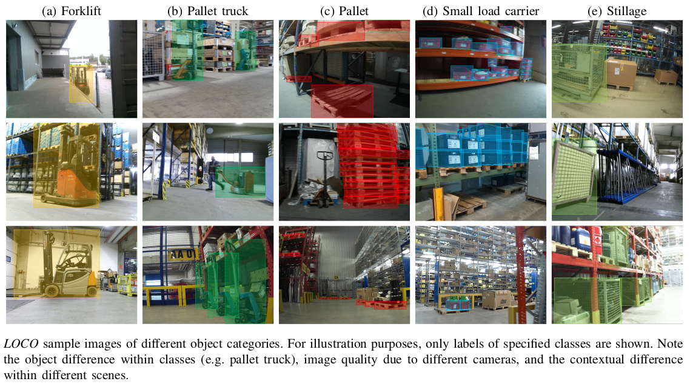

# LOCO: Logistics Objects in Context

LOCO is the first scene understanding dataset for logistics covering the problem of detecting logistics-specific objects. Images are captured while walking through a logistics setting using low-cost cameras. We currently provide 37,988 images captured in 5 logistics environments, of which 5593 images are manually annotated, resulting in 152,421 annotations. Annotated classes include forklifts, pallet trucks, pallets, small load carriers and stillages.  

For more details, we refer to our [paper](https://mediatum.ub.tum.de/doc/1578845/1578845.pdf). If you use LOCO for your research, please consider citeing our work ([Bibtex](https://mediatum.ub.tum.de/export/1578845/bibtex)).

## Dataset
### Data
The annotated dataset can be downloaded [here](https://syncandshare.lrz.de/dl/fiLs87iyphDhmTKh7Xb347sG/dataset.zip). Furthermore, we also provide additional data (not annotated) [here](https://syncandshare.lrz.de/dl/fiqZVRQHJFtmkDx8ghhCBM9/not-annotated-dataset).
### Annotations 
Annotations are stored in [COCO format](https://cocodataset.org/#format-data) under `rgb/loco-all-v1.json`. For ease of use, we also provide seperate annotation files for each subset. 

## License
[CC0](./License) 

